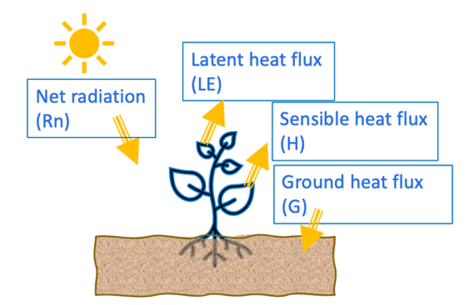

# Constellr ET

Evapotranspiration (ET) by constellr is estimated using two-source models. 
The results of each model are provided as raster files over the area of interest
to empower the end-user in selecting the best approach suitable to their needs. 

## Background

Evapotranspiration (ET) refers to the flow of water leaving the ground
surface per unit of time. It supports the estimation of water consumption 
and water needs and is used to create efficient water budgets at various scales.

constellr models ET using two models:
Priestly-Taylor Jet Propulsion Laboratory (PTJPL) and Two-source model
energy balance (TSEB). They are two-source models, thus they model seperately in two
main components: vegetation transpiration and soil evaporation

constellr models the latent heat flux (LE) and then from it estimates the daily ET.
Both LE and daily ET (mm/d) can be provided by constellr to the end-user as raster files. 

{: style="height:250px"}
<figcaption id="et_flux" tag="image">Energy flux components </figcaption>

## The input data to the ET models

-   Land surface temperature: The [LST30](./lst.md) service of constellr
    provides a combined repository of spaceborne acquired land surface
    temperature from various sensors.

-   Spaceborne data acquired using the visible and near-infrared parts
    of the spectrum (VNIR): Open spaceborne data is leveraged to provide
    the best estimations of bio-physical vegetation parameters.

-   Meteorological data: From local meteorological stations to global
    atmospheric reanalysis datasets, constellr assesses temporal and
    spatial data availability to provide the best input to the ET
    models and to estimate daily ET from instantaneous flux values
    modelled at satellite acquisition time.

{: style="height:300px"}
<figcaption id="et_flow" tag="image">The general methodology of ET modelling </figcaption>

## Specification

| Product Specifications                |                       |
|---                                    |----:                  |
| Spatial resolution (m)                | 30                    |
| Frequency(days)                       | 8                     |
| Coverage                              | Worldwide             |
| Used data sources                     | Public data and LSt30 |
| Latency time after data acquisition   | 12h                   |  
| Period of availability                | June 2018 - ongoing   |
| Spatial accuracy                      | <1 pixel              |

## File-naming convention

Various layers are provided and follow this compact naming convention:

YYYYMMDD_aa_bb.tif

where

-   YYYYMMDD is the datatake sensing date of the land surface temperature in isoformat.  
    Date is based on Universal Time Coordinated (UTC), also known as Greenwich Mean Time (GMT).

-   aa can be either LE (instantaneous ET) or ET (daily estimate)

-   bb is the method name, PTJPL or TSEB

-   .tif is the geospatial raster format used to store the data

Thus, file *20220728_ET \_PTJPL.tif* identifies a daily ET
product estimated using PTJPL acquired by a thermal sensor on the July
28, 2022 UTC

