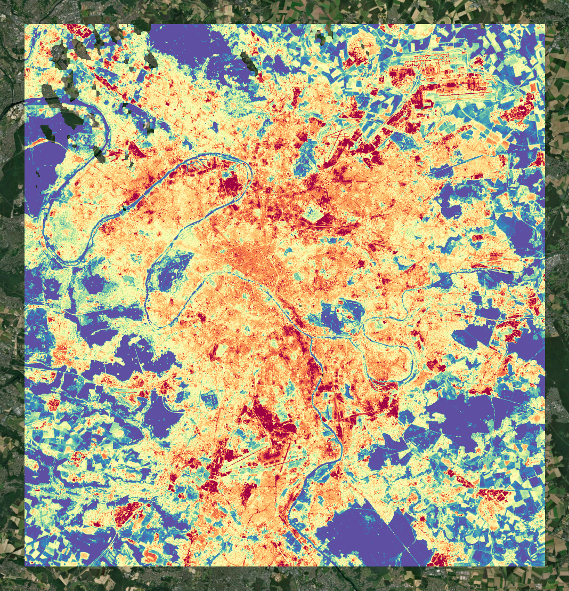
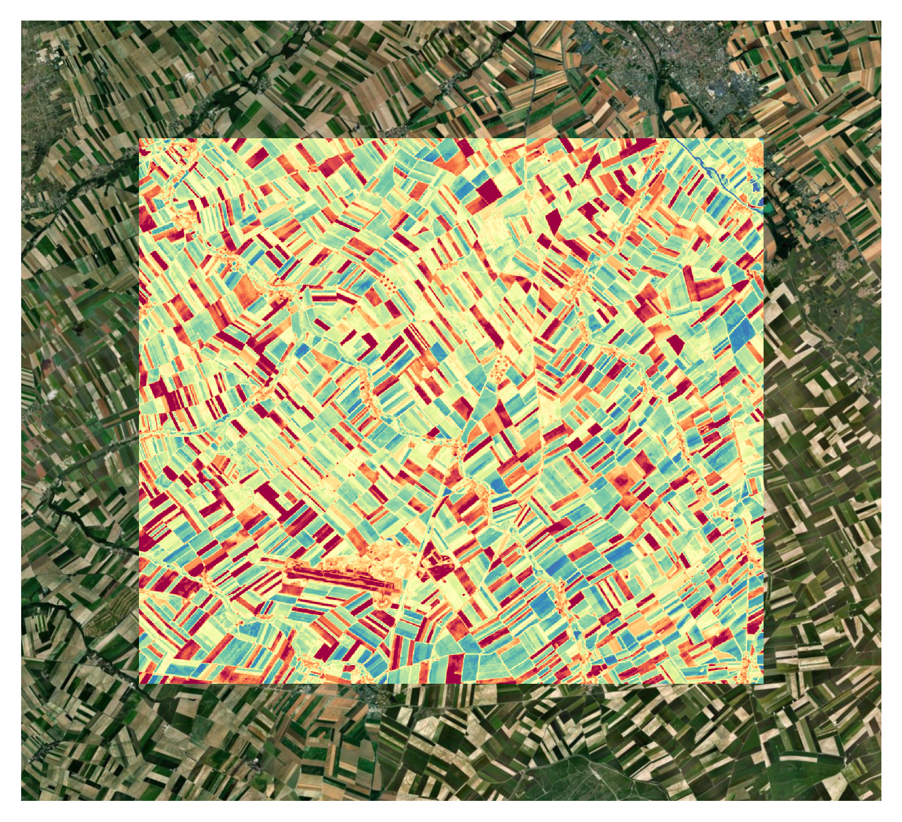

# The urban enviroment

The urban fabric and city planning are key to the understanding of a city's resilience to heat waves in the critical times of climate change. Cities have faced increased heat exposure where managing extreme heat has become critical. The growing impact of urban Heat Islands and inefficient heat insulation in buildings contribute to increased energy consumption, higher temperatures, and reduced quality of life in cities. Traditional methods of monitoring these impacts  fail to provide a comprehensive view of temperature variations across large areas, limiting efforts for mitigation.

constellr's Land Surface Temperature (LST) allows you to monitor heat patterns in urban areas and provides detailed insights from building to neighbourhood level. This enables the pinpointing of hotspots and the optimisation of cooling strategies.

constellr’s products provide an integrated data set that covers your city while allowing for high sensitivity to understand impacts at the building-level. Furthermore, relying on satellite datasets  provides a reliable source of continuous and calibrated information that is reliable for building numerous arrays of tailored solutions by various end-users.

{: style="height:500px"}
<figcaption id="Paris urbarn environment" tag="image">Urban Environment </figcaption>

#### Urban heat island

The urban heat island effect is a critical challenge, amplifying the severity of heat waves in cities. As urban areas expand, they trap heat due to dense infrastructure, lack of vegetation, and heat-absorbing materials. Such compounding effects elevate ambient temperatures that affect energy consumption as well as public health. Traditional heat monitoring methods often fail to capture the full spatial complexity of the urban environment, limiting the effectiveness of mitigation strategies.

Constellr’s Land Surface Temperature (LST) enables cities to achieve a granular understanding of heat distribution across the urban fabric. Capturing characteristics of  individual buildings to entire neighborhoods,   this LST enables urban planners and policymakers to identify critical hotspots and implement targeted cooling solutions with precision.

Constellr’s satellite-based products offer comprehensive, continuous coverage, providing a reliable and a consistent data stream. This empowers cities to develop tailored, data-driven strategies and enhance quality of life while promoting sustainable urban development.

# The agricultural environment

{: style="height:500px"}
<figcaption id="vegetation monitoring" tag="image">Urban Environment </figcaption>

 Agriculture sustains life and provides us for to survive. As essential as it may seem, it has always faced challenges, and even more are expected with the changing climate. With advanced technology like Constellr’s thermal satellite fleet, monitoring plant and soil health at scale yet in detail has become a reality. Reliable traditional methods such as visual inspections or weather-dependent models often detect issues too late and cannot catch up with the mounting challenges that the sector is facing. The negatively affects yield, water quantity and quality, and increases vulnerability to pests and diseases. 

Constellr provides and leverages Land Surface Temperature (LST) data to offer early detection of plant stress and monitor soil conditions across entire fields. By capturing temperature variations, we provide insights into water deficiencies, disease risks, and optimal planting depths in a timely manner that enable building groundbreaking solutions for targeted interventions, improvement of crop health, and yield maximisation.

Our thermal data integrates seamlessly into existing platforms and can be combined with field sensors to give a complete view of soil and plant health that the end-user of comfortable with. With more accurate yield forecasts and data-driven decisions, Constellr empowers smarter, more sustainable farming practices—boosting productivity and profitability across the agricultural supply chain.

#### Vegetation Monitoring

Nurturing seeds, seedlings, and plants at various growth stage in the Earth’s soil is still as essential as ever and with increasing challenges. With great technological developments like Constellr’s thermal fleet of satellites, the effective monitoring of plant health and stress in large-scale agriculture becomes crucial. Current methods, like visual inspections or only relying on weather data, often detect problems too late—leading to lower crop yields, inefficient use of water, and higher susceptibility to disease. This lack of timely insight makes it hard for farmers to apply treatments precisely. Additionally, inaccurate crop yield predictions due to outdated or incomplete data create uncertainty, affecting food production and supply chain planning.

Our solution leverages Land Surface Temperature (LST) to provide early detection of plant stress before visible symptoms appear and to delineate potential hotspot of pest infestations. By capturing temperature variations in crops, we help farmers spot water deficiencies or disease risks early, allowing for precise, variable fungicide application. In addition, our system integrates real-time thermal data with predictive models to improve yield forecasting, enabling more accurate planning and better decision-making.

Constellr’s satellite data delivers smarter, more sustainable farming by optimising inputs, improving crop performance, and boosting profitability. Furthermore, acquiring data using satellites provides a reliable source of continuous and calibrated information that anyone in the agricultural supply chain can rely on and built numerous arrays of tailored solutions. 

#### Soil condition monitoring 

Soil is crucial to our survival, providing us food and clean water, and it is key to combat flooding, drought, and climate change. When planting in the soil, assessing soil temperature patterns that affect planting depth and crop performance is essential. Traditional soil monitoring methods are often manual or limited to sensors at certain locations in the fields. Field-level understanding of soil patterns, especially considering crop rotation and agricultural practices have been lacking in decision-making.

Constellr leverages Land Surface Temperature (LST) data to monitor soil conditions and taps into your parcel's history. Constellr offers precise insights into temperature variations that influence planting depth, germination, and crop growth. This enables farmers to make data-driven decisions for optimal planting strategies, enhancing seed performance and maximising yield potential.

WIth constellr's seamless data access, integration into existing agricultural platforms becomes easy. LST data can be combined with field sensor data for a comprehensive view of soil conditions. This scalable, real-time tool supports precise planting strategies and better crop outcomes, driving more sustainable farming practices.